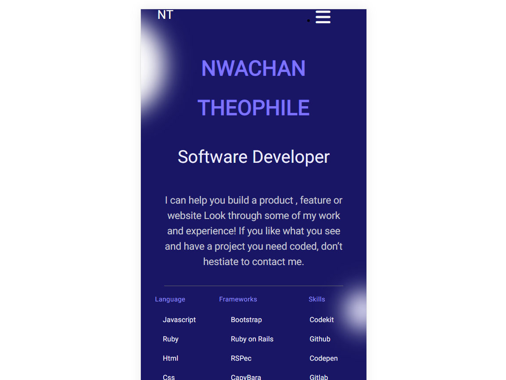
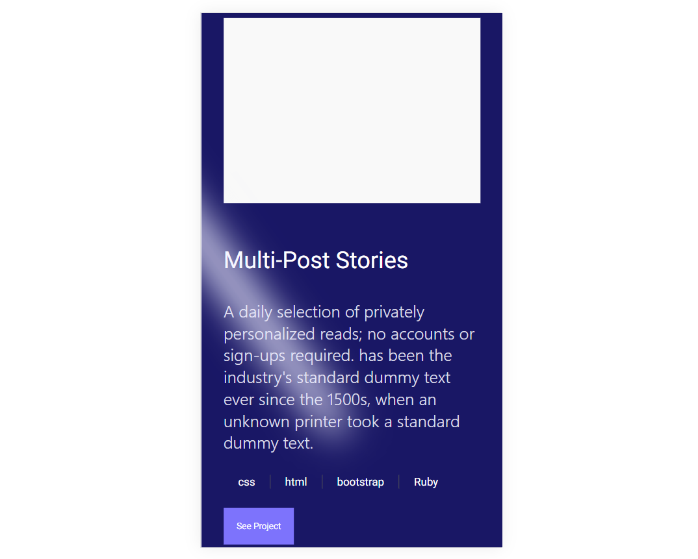

# Software Developer Portfolio

> Software Developer Portfolio is a website for a software developer which outlines all his basic information, skills and projects, built using html, javaScript and npm.

## Website Link

[Click to see Website](https://theophileaseh.github.io/Portfolio/)

## Screenshot

## Built With

- CSS
- HTML
- JavaScript
- npm

## Getting Started

To get a local copy up and running follow these simple example steps.

### Prerequisites

``VS Code or other Code Editor``

``"Live server" configured``

### Install

``git clone https://github.com/Theophileaseh/Portfolio.git``

``cd Portfolio``

### Usage

``Locate index.htm file and open with live server``
<!--``run "npm i"``  
``run "npm start"``-->

## Authors

👤 **Nwachan Theophile**

- GitHub: [@Theophileash](https://github.com/Theophileaseh)
- Twitter: [@NwachanT](https://twitter.com/NwachanT)
- LinkedIn: [LinkedIn](https://linkedin.com/in/nwachan-theophile)

## 🤝 Contributing

Contributions, issues, and feature requests are welcome!

Feel free to check the [issues page](../../issues/).

## Show your support

Give a ⭐️ if you like this project!

## Acknowledgments

- Hat tip to anyone whose code was used
- Inspiration
- etc

## 📝 License

This project is [MIT](./MIT.md) licensed.
